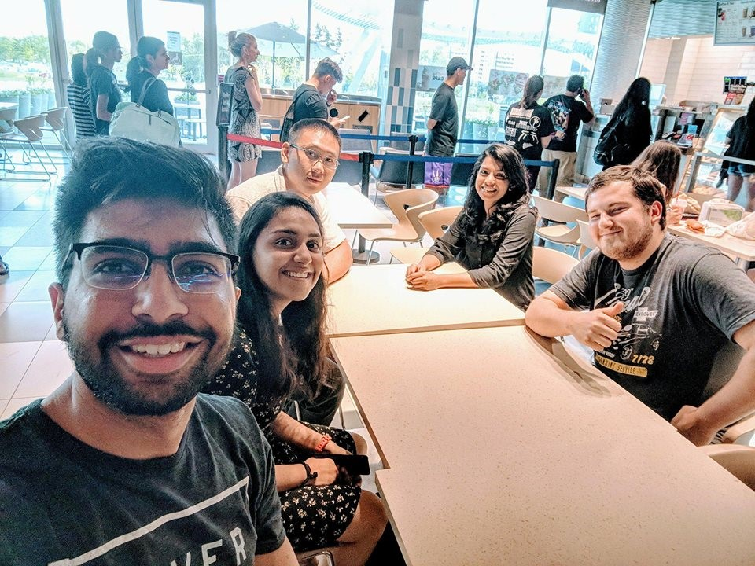

Our group consists of 5 people. The group was formed through mutual connections among team members. Therefore, we did not use any tools to organize the group. We began planning for this project by finding out what technologies/applications each member is familiar with and how strong they are at using them. This information was the core of our decision-making process. During the in-person meeting, we brainstormed ideas on what our application should look like and all the features it should include. It was not hard to make decisions because everyone in the group was open to different ideas. When there were different opinions, we went with the option that we were most confident in and the one which most members can contribute to. The difficulty of the user stories is based on the amount of time required to complete them. While priority is based on how to make the user experience better so the product is easy to understand and use. Priority also keeps in mind any additional features that aren’t required but will be a nice addition to the software.

We met once in person to discuss the main ideas of the project and to assign work to each person. We discuss the progress and give feedback on each other’s work online almost every day. Going forward, we will continue to make sure that we start early and communicate well with team members. As the project progresses, we will be given new requirements and it is essential to start early so that we have enough time to include the new features. We will continue to regularly communicate with each other to make sure everyone is aware of what they are doing as well as what the other team members are working on.

The picture below was taken during our in-person meeting
